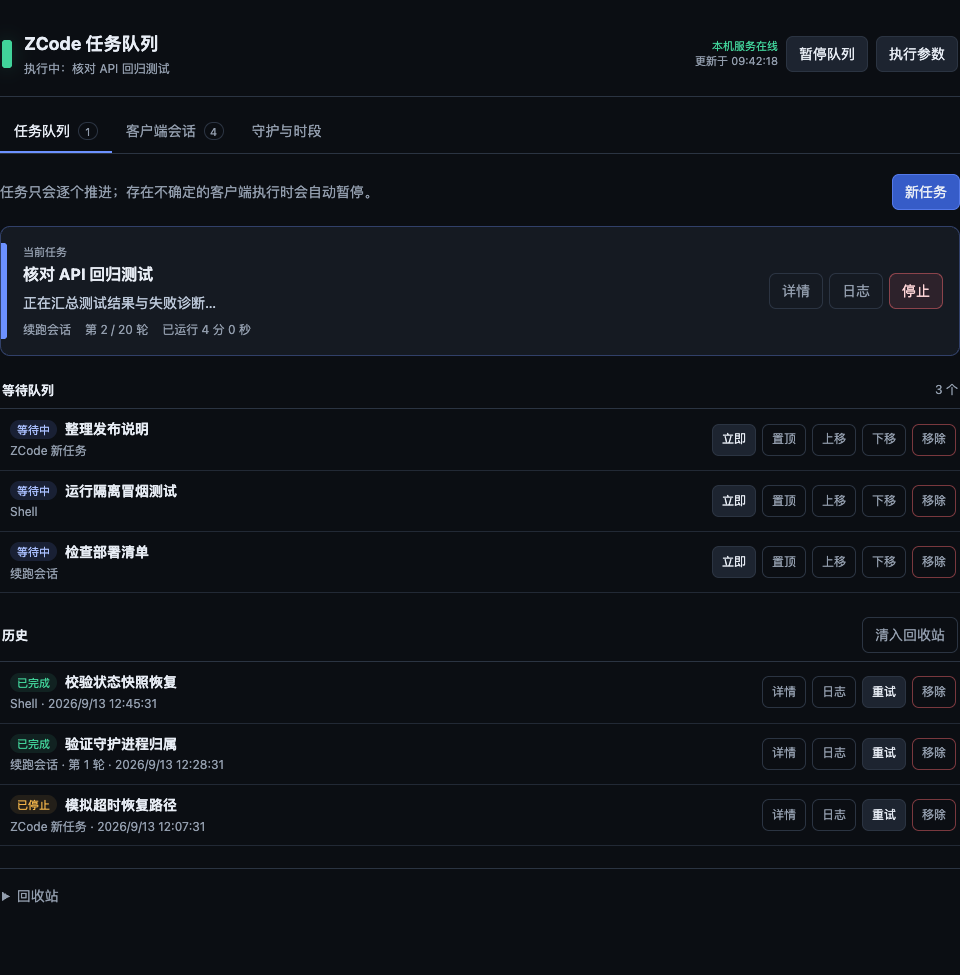
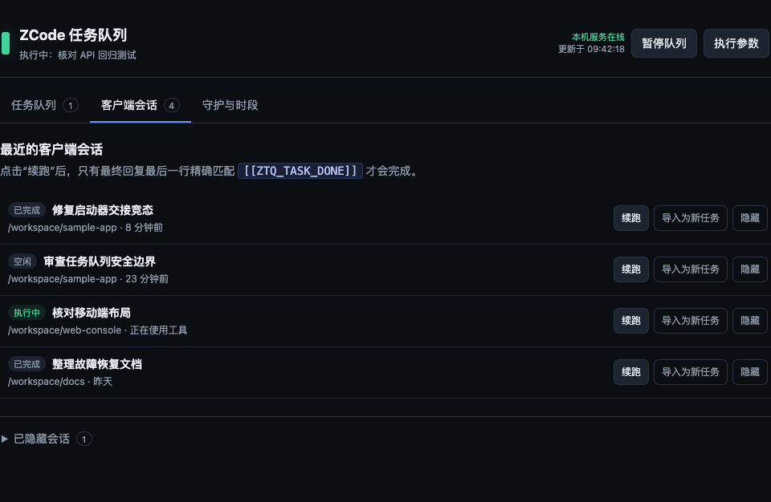
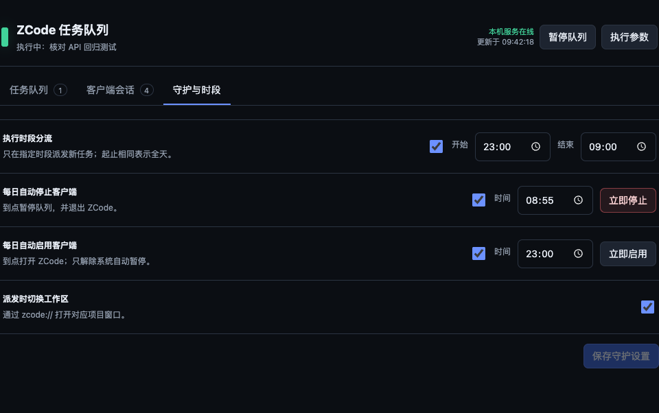

# ZCode 任务队列

[中文](README.md) | [English](README.en.md)

**在 macOS 上，把 ZCode 会话、新任务和本地 Shell 工作排成一条可观察、可恢复的串行队列。**

ZCode Task Queue 是一个只监听本机回环地址的轻量控制台。它复用已登录的 ZCode 桌面客户端，在一个服务实例内始终只推进一项工作，并把等待、执行、历史、异常确认和定时守护集中到同一个网页里。

项目运行时没有第三方 npm 依赖，不需要 ZCode 或模型供应商 API Key，也不会绕过套餐、配额或并发限制。任务仍然使用客户端当前账号的模型与额度；Web 控制面使用独立的本机 Bearer 令牌。

*队列总览：当前任务、等待队列、历史结果和回收站集中在一个页面中。*

## 适合什么场景

- 把多个耗时 ZCode 任务按顺序交给客户端，避免本队列自己抢占并发位。
- 让一个已有会话持续推进多轮，直到它明确报告完成。
- 把 ZCode 工作与构建、测试、导出等本地 Shell 步骤放进同一队列。
- 只在指定时段派发任务，并按计划停止或重新打开 ZCode 客户端。
- 在客户端数据库、调度记录或进程状态无法确认时停下来，交给人核对，而不是继续猜测。

它不是远程任务平台，也不是多实例协调器。串行保证只覆盖**同一个服务实例**派发的任务；用户手动启动的 ZCode 会话、其他工具，以及指向同一 ZCode 配置的另一个队列实例仍可能并发。

## 页面一览

### 客户端会话

查看近期会话及其活动状态，可以直接续跑、导入为新任务或暂时隐藏。续跑会继续使用原会话上下文。

### 守护与时段

设置跨午夜执行窗口、每日停止/启用客户端时间，以及派发时是否切换工作区。截图展示的是**演示配置**；这些开关的出厂默认值均为关闭。

> 三张截图均由当前前端在完全隔离的临时服务中渲染，使用临时状态目录、临时 SQLite 以及虚构任务、会话和路径；不包含真实队列数据、访问令牌或个人路径。

## 主要能力

| 能力 | 行为 |
|---|---|
| 单实例严格串行 | 续跑已有会话、新建 ZCode 任务，或执行本地 Shell 命令 |
| 可恢复派发 | 先原子记录派发意图，再写入稳定 automation ID；重启后对账而不是盲目重复 |
| 安全暂停 | 无法证明客户端或子进程状态时进入“需确认”，阻止下一项派发 |
| 实时控制台 | SSE 推送活跃摘要；断线时降级为轮询，完全离线后禁用写操作 |
| 队列管理 | 暂停/恢复、立即执行、置顶、移动、停止、重试、软删除与 7 天内恢复 |
| 会话管理 | 查看近期会话、待办与工具活动；续跑、导入、隐藏和恢复显示 |
| 执行窗口 | 支持跨午夜；起始时刻包含、结束时刻不包含；起止相同表示全天；不会中断已在执行的任务 |
| ZCode 守护 | 可定时停止/打开客户端，不覆盖手动暂停或更高优先级的安全暂停 |
| 本机安全边界 | 回环监听、Bearer 授权、POST 本机头、Origin 检查、幂等写入与安全响应头 |
| 可访问界面 | 原生 dialog、键盘 tabs、焦点恢复、移动端布局和 44 px 触控下限 |

## 安装与启动

> **⚠️ 重要：数据目录权限要求**
> 
> 请将 `data` 目录放在**启用文件所有权的外置文件系统**上（如内置 SSD）。如果数据目录位于启用"忽略此卷的所有权"的外置 APFS 卷或不支持 Unix 权限的文件系统（如 FAT32、exFAT），则 `0600/0700` 权限不是有效的多用户安全边界。
> 
> 服务代码、控制脚本、状态和 Bearer 令牌中的任一项被其他本机用户篡改都可能转化为服务用户权限。建议将 runtime、控制入口、state/run/log 和 token 一并放在启用所有权的可信本机文件系统；只迁移数据目录并不足以建立该边界。工作素材仍可位于外盘，但任务应显式填写工作目录。

运行条件:

- **macOS**；启动器、ZCode 进程识别和可选的 launchd 服务均面向 macOS。
- **Node.js 22.13.0 或更高版本**，且能不带实验参数直接加载 `node:sqlite`。
- ZCode 桌面客户端已经登录，并至少在本机成功运行过一次。

~~~bash
git clone https://github.com/Samoyer/zcode-task-queue.git
cd zcode-task-queue
./start.sh preflight
./start.sh start
~~~

`start` 会打印一条带 `#token=...` 的完整授权链接，复制到浏览器打开即可。不要只打开裸的 `http://127.0.0.1:8787`，那样页面没有 API 授权。令牌位于 URL fragment，不会随首个 HTTP 请求发出；页面读取后会立即把它从地址栏和浏览器历史中移除。

常用命令：

| 命令 | 用途 |
|---|---|
| `./start.sh preflight` | 检查 Node / `node:sqlite`、参数与可写路径布局，并显示 PID、ready 文件和监听设置 |
| `./start.sh start` | 在后台安全启动一个实例 |
| `./start.sh status` | 检查实例身份与健康状态，并重新显示授权链接 |
| `./start.sh restart` | 停止已验证的当前实例并重新启动 |
| `./start.sh stop` | 停止已验证的当前实例 |

也可用 `node server.js` 在前台运行。日常使用更建议通过 `start.sh`：它会核对 PID 所属用户、启动时间、Node 可执行文件、工作目录、服务根路径和健康接口，不会只凭一个可能被复用的 PID 发信号。

`start` / `stop` / `restart` 使用生命周期锁串行执行。`status` 退出码为：`0` 健康、`3` 未运行、`4` PID 身份不可信、`5` 进程存在但健康检查失败；锁等待超时约 15 秒，退出码为 `6`。早期启动输出写入 `${ZTQ_LOG_FILE}.startup`，失败诊断会先脱敏令牌，运行期日志写入 `ZTQ_LOG_FILE`。

## 三类任务

| 类型 | 完成条件 |
|---|---|
| 续跑会话 | run 成功、没有工具仍在运行，且本轮最新助手回复的最后一个非空行精确等于完成标记 |
| ZCode 新任务 | 客户端 automation run 到达成功终态 |
| Shell 命令 | 本地非交互 `/bin/zsh -lc` 进程成功退出 |

续跑会话的默认精确标记是：

~~~text
[[ZTQ_TASK_DONE]]
~~~

队列先把派发意图原子落盘，再使用由任务 ID 和轮次稳定生成的 automation ID 写入 ZCode 任务索引库。ZCode 接单后，队列只读会话库，跟踪本轮新消息、工具状态和 run 结果。“尚未全部完成”、引用标记，或标记后还有文字，都不会被误判为完成；未命中时会继续下一轮，直到命中或达到最大轮数。

## 安全暂停与人工确认

队列不会把“不知道”伪装成“已停止”。下列情况会进入“需确认”并阻止后续派发：

- 已观察到的 automation 记录消失、持续无法读取客户端数据库，或上一轮清理无法确认。
- 客户端可能已接单时超时、长时间无本轮活动，或用户停止了 ZCode 任务的队列监控。
- 服务重启后无法证明 Shell 子进程是否仍在运行，或状态中出现多个非终态任务。

页面提供两种恢复路径：

- **重新接管监控**：只有调度记录仍存在，且标题、提示词、模型、工作目录和目标会话全部与已落盘意图一致时才允许。
- **确认并继续队列**：把当前项记为状态不确定的失败。只应在人工确认客户端不会与下一项并发后使用。

“立即执行”只绕过执行时段和当前任务间隔，不绕过手动暂停、安全暂停、存储故障或另一项正在运行的任务。

> **停止语义：** 对已派发的 ZCode 任务，页面“停止”只停止本队列的监控并进入“需确认”；若能证明客户端尚未接单，则会先原子撤销再标记停止。关闭/重启队列服务不会取消客户端会话；重启后会先对账并在证据完整时恢复监控，只有调度证据缺失、冲突或不可读时才进入“需确认”。Shell 任务会尝试终止完整进程组，无法证明后代已退出时也会进入“需确认”。

定时停止客户端只会向实际可执行路径验明的当前用户 `ZCode.app` 主进程及其已记录后代发送信号。独立 `zcode-cli`、crashpad 和 `ZCode Computer Use` 不会被停止；只发现无法归属的 helper 时不发信号，而是持续进入“需确认”。若要在自动启用时刻前手动重开客户端，请先关闭自动停止。

页面的可安全重试写请求使用独立 `Idempotency-Key`。响应丢失时只用原 key 做不会创建新操作的 replay-only 查询；服务端无法证明原结果时保留墓碑并要求人工核对，不会静默换 key 重发。

## 状态文件与升级

新版使用单一快照 `data/state.json`，并保留上一代 `data/state.json.bak`。文件以 0600 权限、同目录临时文件、`fsync` 和原子 rename 写入；数据目录尽量收紧为 0700。

权限收紧是尽力而为：如果文件位于启用“忽略此卷的所有权”的外置 APFS 卷或不支持 Unix 权限的文件系统，0600/0700 不是有效的多用户安全边界。由于服务代码、控制脚本、状态和 Bearer 令牌中的任一项被其他本机用户篡改都可能转化为服务用户权限，请把用于实际运行的 runtime、控制入口、state/run/log 和 token 一并放在启用所有权的可信本机文件系统；只迁移数据目录并不足以建立该边界。工作素材仍可位于外盘，但任务应显式填写工作目录。

首次升级时：

- 已有 `data/tasks.json` 和 `data/settings.json` 会合并迁移；原文件保留，并各生成一份 `.legacy.bak`。
- 只有仍使用旧版出厂续跑话术和“全部完成”标记的设置才自动迁移到 `[[ZTQ_TASK_DONE]]`；自定义值不改。
- 自动停止/启用从迁移时刻建立基线，不补执行迁移前已经过期的事件；首次状态与初始化标记之间即使发生写入故障，也不会留下可重放旧事件的窗口。

主快照损坏或缺失时，服务会恢复上一代、隔离损坏文件，并强制暂停等待确认。恢复时会先把守护水位推进到本次激活时刻并同步到主、备两代，因此不会补执行备份滞后期间的 stop/enable；已有的 stop ownership 锁存仍会保留，恢复/确认也不能绕过它。主快照和备份都不可用时，健康检查返回 503，`start.sh` 报启动失败且不会留下孤儿进程。

## 测试

~~~bash
npm run check
npm test
./smoke-test.sh
~~~

- `npm test` 在临时目录和临时 SQLite 上覆盖核心逻辑、HTTP/SSE、持久化故障、崩溃对账、启动器身份与 launchd 生成器。
- `smoke-test.sh` 运行 19 个发布检查：功能任务全部使用随机端口、隔离服务、临时状态与 SQLite，不消耗 ZCode 配额；另有一项只读生产文件哈希核对。报告写入 `test-report.md`。
- 冒烟测试前后会只读计算生产队列与真实 SQLite 主文件/WAL/SHM 的哈希。如果 ZCode 同时写入，哈希变化只表示证据无效，不能归因给测试；需在静默窗口重跑。
- `test/ui-playwright.py` 是可选的真实浏览器验收，需要 Python Playwright 和 Chromium/Chrome，并必须指向隔离服务。

## 开机自启（可选）

不要直接安装带占位符的模板。先用生成器把当前 Node、项目根目录、用户目录和数据路径写入最终 plist：

~~~bash
./start.sh stop
node launchd/render.js "$HOME/Library/LaunchAgents/com.zcode-task-queue.plist"
plutil -lint "$HOME/Library/LaunchAgents/com.zcode-task-queue.plist"
launchctl bootstrap "gui/$(id -u)" "$HOME/Library/LaunchAgents/com.zcode-task-queue.plist"
launchctl kickstart -k "gui/$(id -u)/com.zcode-task-queue"
launchctl print "gui/$(id -u)/com.zcode-task-queue"
~~~

卸载：

~~~bash
launchctl bootout "gui/$(id -u)/com.zcode-task-queue"
~~~

生成的任务使用 `Umask=0077`，只在异常退出时重启，并有 10 秒节流。生成器会预创建选定的 stdout/stderr 父目录和日志文件，拒绝符号链接，并尽量设为 0700/0600。项目、Node 或数据目录移动后必须重新生成 plist。`start.sh` 与 launchd 二选一管理服务；不要同时运行多个指向同一 ZCode 配置的队列实例，即使它们使用不同端口或数据目录。

更新已加载的 launchd 任务时，先用上面的 `bootout` 卸载，再重新生成、`plutil -lint`和 `bootstrap`；直接改写磁盘上的 plist 不会更新已加载配置。如果设置了自定义 `ZTQ_LAUNCHD_LABEL`，所有 `launchctl` 命令也要使用该 label。

## API

除 `/api/health` 外，所有 API 都必须携带 `Authorization: Bearer <token>`；令牌来自 `ZTQ_API_TOKEN_FILE`。浏览器 `EventSource` 无法自定义请求头，因此只有回环上的 `/api/events` 也接受 `?token=`。所有 POST 还必须携带 `X-ZTQ-Local: 1`；如有 `Origin`，也必须是本机回环来源。

可安全重试的写请求应携带唯一 `Idempotency-Key`。网络结果不确定后，使用同一 key 和完全相同的请求，并增加 `Idempotency-Replay-Only: 1`：只有已记录结果才会返回，记录不存在时返回 `409 IDEMPOTENCY_REPLAY_UNKNOWN` 且不写入。服务端记录严格有效 24 小时且最多 200 条，所以该 409 必须人工对账，不可盲目改 key 重发。`/api/guard` 会直接启停客户端，不支持 replay-only，页面也不会自动重试。

这枚本机令牌可以创建 Shell 任务，因而等同于以服务用户身份执行任意本机命令的凭据。不要分享授权链接或令牌文件，也不要把服务转发到局域网或公网。

| 端点 | 方法 | 说明 |
|---|---|---|
| `/api/health` | GET | 实例、PID、Node、路径、存储与客户端数据库健康状态 |
| `/api/state?view=summary` | GET | 活跃任务摘要、队列、设置与客户端会话 |
| `/api/events` | GET | 带单调 revision 和 instance ID 的 SSE 摘要 |
| `/api/tasks?status=history\|trash` | GET | 历史/回收站分页 |
| `/api/tasks/:id` | GET | 单项完整详情 |
| `/api/tasks/log?id=` | GET | 单项日志 |
| `/api/tasks` | POST | 新建任务；`batch` 可按非空行批量创建 |
| `/api/tasks/:id/action` | POST | `up` / `down` / `top` / `runNow` / `retry` / `remove` / `restore` / `reattach` / `acknowledge` |
| `/api/queue` | POST | `pause` / `resume` / `clearFinished` / `restoreDeleted` / `stopCurrent`；停止必须附当前 `taskId` |
| `/api/client-tasks/continue` | POST | 续跑最近会话 |
| `/api/client-tasks/import` | POST | 导入最近会话的首条用户提示词为新任务 |
| `/api/client-tasks/hide` | POST | 隐藏会话 |
| `/api/client-tasks/unhide` | POST | 恢复显示会话 |
| `/api/guard` | POST | `stopClient` / `enableClient`；停止支持 `dryRun` |
| `/api/config` | POST | 修改执行、模型、完成标记和守护设置 |

## 环境变量

| 变量 | 默认 | 说明 |
|---|---|---|
| `ZTQ_HOST` | `127.0.0.1` | 只允许 `127.0.0.1`、`::1` 或 `localhost` |
| `ZTQ_PORT` | `8787` | `0` 由内核分配随机端口，实际值写入 ready 文件 |
| `ZTQ_DATA_DIR` | `<项目>/data` | 状态与日志目录 |
| `ZTQ_PID_FILE` | `<data>/server.pid.json` | 带进程身份的 PID 文件 |
| `ZTQ_READY_FILE` | `<data>/ready.json` | 已就绪实例、端口与启动 token |
| `ZTQ_LOG_FILE` | `<data>/server.log` | 服务日志；启动时以 5 MiB 为阈值轮换，保留 3 份历史副本和当前日志 |
| `ZTQ_NODE_BIN` | PATH 中的 `node` | `start.sh` 与 launchd 生成器使用的 Node 绝对路径 |
| `ZTQ_HOME_DIR` | 当前用户目录 | ZCode 路径探测与默认令牌位置的根目录；主要用于隔离测试 |
| `ZTQ_API_TOKEN_FILE` | `<ZTQ_HOME_DIR>/.zcode-task-queue/api-token` | 本机 API Bearer 令牌；缺失时自动创建，已有时必须是当前用户拥有、非符号链接、内容为 64 位小写十六进制的普通文件 |
| `ZTQ_CLIENT_INDEX_DB` | 自动探测 | ZCode 任务索引 SQLite；队列只写自己的 automation/run 记录 |
| `ZTQ_CLIENT_SESSION_DB` | 自动探测 | ZCode 会话 SQLite，以只读模式打开 |
| `ZTQ_CLIENT_CONFIG` | 跟随索引库 | 用于读取当前可用模型 |
| `ZTQ_START_WAIT_TENTHS` | `100` | `start.sh` 就绪等待的 0.1 秒单位次数，范围 1–600 |
| `ZTQ_LAUNCHD_LABEL` | `com.zcode-task-queue` | launchd 生成器使用的任务 label |
| `ZTQ_LAUNCHD_STDOUT` | `/dev/null` | launchd 的标准输出文件；改为文件时会安全预创建 |
| `ZTQ_LAUNCHD_STDERR` | `<data>/launchd.stderr.log` | launchd 捕获启动前/异常日志的文件 |

使用 `start.sh` 时，所有显式文件/目录覆盖必须是绝对路径。`ZTQ_TEST_MODE` 及轮询、调度宽限等内部时间变量仅用于隔离测试和故障注入，会在启动前校验为有界整数毫秒，不建议写入日常配置。

Shell 任务以服务当前用户的权限和环境在任务工作目录（未设置时为项目根）执行 `/bin/zsh -lc <command>`，且是非交互的：标准输入在启动时立即 EOF。超时、手动停止、服务停止以及主 Shell 正常退出后，队列都会尝试清理整个独立进程组；如无法证明后代已退出，任务进入“需确认”而不继续队列。

## 运行边界

- 串行保证只覆盖单个队列实例派发的工作；用户或其他工具直接在 ZCode 启动的会话仍会并发并占用套餐并发位。
- 实例锁只保护同一个数据目录。不要运行多个指向同一 ZCode 配置的队列实例，即使它们使用不同的数据目录或端口。
- 队列直接依赖 ZCode SQLite 的当前表和字段；客户端升级后应重跑回归并核对 schema。只看到数据库文件存在，不等于版本兼容已被证明。

## 项目结构

~~~text
server.js                 HTTP/SSE、安全头、ZCode 守护与服务生命周期
lib/queue-runtime.js      队列状态机、幂等派发、对账与安全暂停
lib/client-db.js          ZCode SQLite 读取、automation 写入和指纹核对
lib/state-store.js        版本化原子快照、备份与损坏恢复
public/                   无内联脚本的响应式 Web UI
launchd/                  plist 模板与安全生成器
test/                     Node 回归、SQLite fixture 和 Playwright 验收
smoke-test.sh             完全隔离的发布前冒烟测试
~~~

## License

[MIT](LICENSE)
